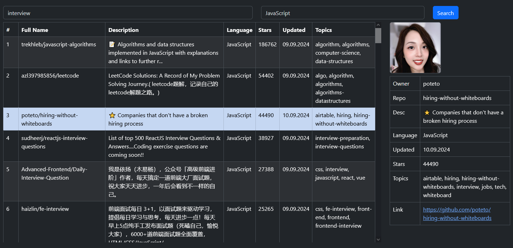

## GitHub Search App

Simplified version of GitHub [Search](https://github.com/search/advanced)



## How to run

[Generate](https://github.com/settings/tokens/new) GitHub token and add it to [global.js](global.js)

Install dependencies and run the project:
```
npm ci
npm start
```

>[!WARNING]
>The build will fail with an error if there is no token

Test production build:
```
npm run build:prod
serve
```

[](https://myhits.vercel.app)
